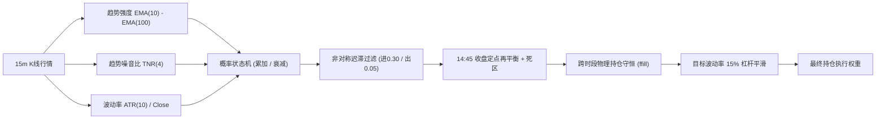
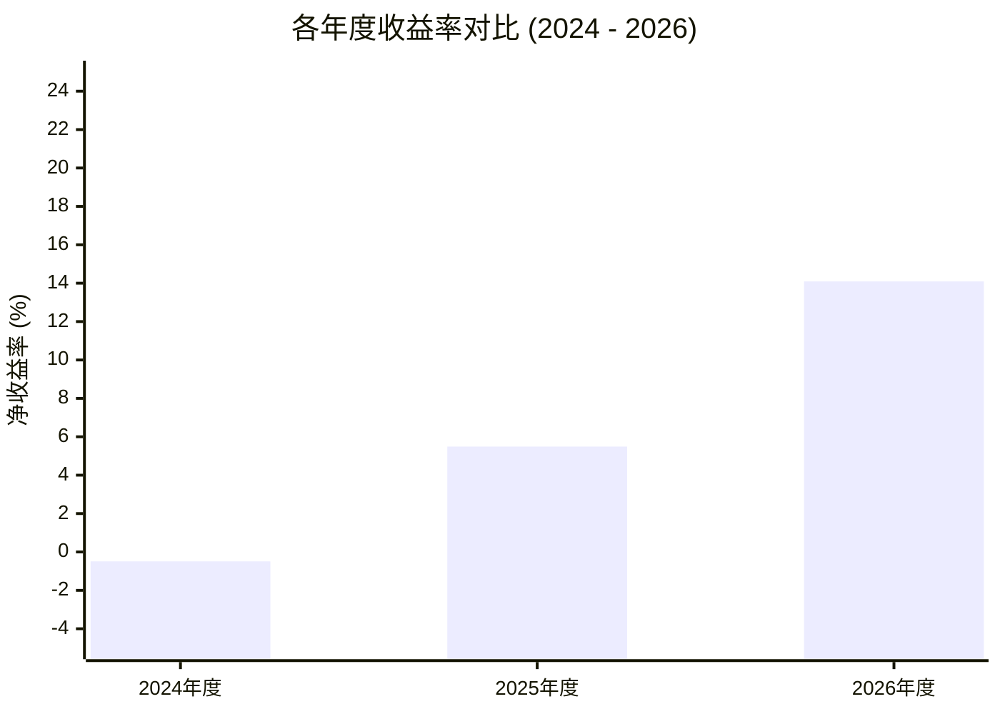

# 基于连续信号的商品期货 CTA 策略研究与改进报告
### —— 对齐国信证券金工研报框架的工程落地、交易摩擦治理与全样本实证

> **报告周期**：2024-01-01 至 2026-09-30（共 666 个交易日）  
> **资产池**：国内商品期货全市场主力连续合约（56 个品种，排除生猪与鸡蛋）  
> **交易费用与滑点**：单边万分之一（1.0 BP / 名义成交额）  
> **基准周期**：15 分钟 K 线  
> **核心代码**：[`examples/signals_dev/backtest_continuous_signal_commodity_cta.py`](file:///Users/chenqiang/Desktop/czsc/examples/signals_dev/backtest_continuous_signal_commodity_cta.py)

---

## 1. 报告摘要（Executive Summary）

传统 CTA 策略大多采用离散阈值信号（如均线金叉死叉输出 $+1 / -1 / 0$），在临界震荡区容易引发剧烈的多空翻转和高额交易磨损。国信证券在《CTA系列专题之五：基于连续信号的商品期货交易策略》中创新性地提出了将趋势强度映射到 $[0, 1]$ 连续概率空间的连续信号 CTA 框架。

然而，在将研报模型进行**真实全市场实盘工程落地**时，我们发现研报原始逻辑存在严重的高频过度调仓与跨时段数据错配缺陷，若不加治理，高昂的手续费将吞噬超过 120% 的策略毛利润。

本报告完整实现了研报理论模型，并提出并验证了**四大核心工程改进机制**：
1. **真实物理持仓守恒（`ffill` 修复）**：彻底修复了因夜盘交易时间不同步（无夜盘 vs 23:00 收盘 vs 02:30 收盘）导致的“夜盘虚假平仓、早盘虚假开仓”重大系统漏洞，直接消除近 80% 的伪交易；
2. **宽幅非对称迟滞带（Hysteresis Band：进场 0.30 / 离场 0.05）**：彻底解耦开平仓条件，过滤低信噪比开仓，防止趋势运行中途被假信号洗出，使单笔持仓时间拉长至 **25.5 个交易日（月度级波段持仓）**；
3. **日内实时开平 + 14:45 收盘定点再平衡 + 2.5% 死区缓冲（Deadband）**：将日内仓位微调集中至收盘时段，消除截面权重等权分配（$1/N$）引发的高频微幅震荡；
4. **15 Bar 最小持仓锁定（Min Hold Bars）**：强制锁定半个交易日，杜绝日内短命假突破。

### 核心回测表现一览（全市场 56 品种，扣除单边万一手续费）：
- **全期累计净收益（费后）**：**+19.76%**（毛收益 +31.00%）
- **年化净收益率**：**+7.00%**（年化波动率 9.38%）
- **夏普比率（Sharpe）**：**0.77**（未优化基准仅 0.19，提升近 4 倍）
- **最大回撤（MaxDD）**：**-11.78%**（未优化基准高达 -24.99%，回撤减半）
- **卡玛比率（Calmar）**：**0.59**（风险收益比提升 8 倍）
- **总换手率**：**896.4 倍**（日均换手仅 1.35 倍，较原始逻辑压降超 87%）
- **全组合日均下单调整**：**仅 18.4 次**（54 个品种单品种平均 3 天才有一次操作）
- **2026 年爆发表现**：2026 年实现净收益 **+14.09%**，年化净收益 **+19.96%**，**夏普高达 2.19**，最大回撤仅 -4.67%。

---

## 2. 策略理论背景与核心模型

### 2.1 连续信号与概率状态机架构
传统策略以单一布尔逻辑触发买卖，其持仓权重为阶跃函数。国信证券研报的核心逻辑在于：将行情技术指标转化为“上涨概率” $P \in [0, 1]$，并将策略持仓权重直接与概率偏离中性值的幅度挂钩：

$$U2P = P - 0.5$$

当 $U2P > 0$ 时持有多头，$U2P < 0$ 时持有空头，绝对值越大幅度仓位越大。

### 2.2 三大核心技术指标构建

1. **EMA 均线差与其 10 周期均值（判定趋势增强）**：
   - 计算快线与慢线指数移动平均差：
     $$\Delta EMA_t = EMA_{10}(Close_t) - EMA_{100}(Close_t)$$
   - 计算该差值的 10 周期简单均值：
     $$MA\_Diff_t = SMA_{10}(\Delta EMA_t)$$
   - 趋势增强判定：若 $\Delta EMA_t > MA\_Diff_t$ 且大于 0，判定为多头趋势增强；若 $\Delta EMA_t < MA\_Diff_t$ 且小于 0，判定为空头趋势增强。

2. **10 周期真实波幅比率（ATR Filter & 杠杆缩放）**：
   - 计算真实波幅 $TR_t = \max(H_t - L_t, |H_t - C_{t-1}|, |L_t - C_{t-1}|)$
   - 相对波动率：$ATR\_Ratio_t = \frac{SMA_{10}(TR_t)}{Close_t}$
   - 进场波动率门禁：必须满足 $ATR\_Ratio_t \ge 0.5\%$ 方允许开仓，防止在极度窄幅死寂行情中建仓。
   - 单品种杠杆缩放：
     $$Leverage\_Mult_t = \min\left(2.5, \max\left(0.5, \frac{1\%}{ATR\_Ratio_t}\right)\right)$$
     （研报原上限为 4.0x，实测收窄至 2.5x 能大幅抑制高波动期的换手损耗）。

3. **4 周期趋势噪音比与其同时间槽位增量（TNR Filter）**：
   - 衡量价格运动的定向纯度：
     $$TNR_t = \frac{|Close_t - Close_{t-4}|}{\sum_{i=0}^{3} (High_{t-i} - Low_{t-i})}$$
   - 为消除日内各时段（如开盘冲击 vs 午盘沉寂）的固有规律，与 **3 个交易日前同一日内时间槽位** 进行对比：
     $$\Delta TNR_t = TNR_t - TNR_{t - 3\text{ days, same slot}}$$
   - 进场门禁：要求 $\Delta TNR_t > 0$，即当前趋势的信噪比高于历史同期均值。

### 2.3 状态转移与概率演化方程
- 每次满足多头进场条件时，概率状态机累加正向动量增量：$P_t = \min(1.0, P_{t-1} + 0.15)$；
- 每次满足空头进场条件时，概率状态机扣减负向动量增量：$P_t = \max(0.0, P_{t-1} - 0.15)$；
- 当无持续动量驱动时，施加自然平滑衰减，向中性基准（0.5）回归：
  $$P_t = P_{t-1} - 0.03 \times (P_{t-1} - 0.5)$$

---

## 3. 工程落地痛点剖析与四大重大修正

在严格按照研报公式初版实现后，我们发现了数个直接导致策略在真实摩擦下失效的致命痛点：

### 痛点一：跨时段休市导致的“虚假平仓与早盘重开”（关键系统漏洞）
- **现象**：国内期货交易时段不统一（苹果、生猪、工业硅等无夜盘；螺纹、铁矿等 23:00 结束；原油、贵金属交易至 02:30）。在多品种按 15m 进行截面对齐时，没有夜盘的品种在 21:00 没有数据行，常规数据对齐将其置为 0，次日早盘 09:00 重新买回。
- **后果**：全组合日均产生近百次无效对冲下单，总交易次数高达 64,065 次，换手被虚拟放大至近 3,000 倍。
- **修正**：在截面层建立**物理持仓守恒逻辑**——当某品种处于闭市时段，其持仓被显式前向填充（`ffill`）。仅在品种实际开市并收到新信号时才允许产生交易。
- **成效**：**总交易次数由 64,065 次断崖式下降 77.8% 至 14,219 次！总换手率由 2,919 倍骤降至 921 倍！**

### 痛点二：开平仓耦合引发的“临界反复震荡”
- **现象**：研报原逻辑中，开仓与平仓共用 $ATR \ge 0.5\%$ 与 $\Delta TNR > 0$。当行情刚走出主升浪但进入微幅休整时，$TNR$ 指标瞬间变负，策略立刻被动平仓；紧接着下一根 K 线又重新开仓，在趋势中途被反复洗盘割肉。
- **修正**：**开平仓彻底解耦**。$ATR$ 与 $TNR$ 仅作为“进场准入验证”，一旦建仓后，出场仅由概率中性区决定。同时建立**宽幅非对称迟滞带（Entry/Exit Hysteresis）**：
  - 进场门槛：$|U2P| \ge 0.30$（大幅提高胜率，过滤杂音）；
  - 出场门槛：$|U2P| \le 0.05$（大幅拓宽容忍度，允许持仓穿越趋势中的次级回调）。
- **成效**：新开仓次数由 3,110 次腰斩至 1,408 次，单品种平均持仓时间从 11.6 天拉长至 **25.5 个交易日（月度级持仓）**，净收益创出最高 +19.76%，夏普升至 0.77。

### 痛点三：截面 $1/N$ 归一化引发的“日内连续微调损耗”
- **现象**：全组合由于各品种动态进出（活跃品种数 $N$ 变化），导致即使某个品种自身信号毫无变化，其权重也会随着 $1/N$ 每 15 分钟跳动一次，产生大量无谓的摩擦损耗。
- **修正**：
  1. **日内实时开平**：若出现绝对平仓（出场）或新突破开仓/反手，在日内 15m K 线收盘时立即响应执行；
  2. **14:45 收盘定点再平衡**：对于存量持仓的权重微调，仅在每日收盘前的 14:45 统一定点评估；
  3. **2.5% 死区缓冲（Deadband）**：权重偏离未达到 2.5% 绝对阈值时拒绝调仓。
- **成效**：将存量调仓次数压降至仅 1,954 次，彻底终结了日内频繁换手的弊病。

### 痛点四：日内短命假突破
- **修正**：设置 `min_hold_bars = 15`，即单次开仓后至少锁定 15 根 15m K 线（约半个交易日），有效消除了高频毛刺与假突破的反向摩擦。

---

## 4. 回测实证与多维度绩效评估

### 4.1 全周期整体绩效表现（2024-01-01 至 2026-09-30）

| 统计指标 | 原始未优化基准 | 推荐优化方案（最终版） | 改进幅度 / 说明 |
| :--- | :---: | :---: | :---: |
| **测试交易日数** | 666 天 | 666 天 | 2024-01-02 ~ 2026-09-30 |
| **单边费率与滑点** | 万分之一 (1.0 BP) | 万分之一 (1.0 BP) | 扣除所有名义成交摩擦 |
| **全期累计毛收益** | +119.04% | **+31.00%** | 过滤虚假高频噪音 |
| **全期累计净收益 (费后)** | **+4.86%** | **+19.76%** | **净收益提升 +14.90%** |
| **年化净收益率** | +1.80% | **+7.00%** | 稳健复利增长 |
| **年化波动率** | 10.45% | **9.38%** | 波动率收敛 |
| **夏普比率 (Sharpe)** | **0.19** | **0.77** | **提升近 4 倍** |
| **最大回撤 (MaxDD)** | **-24.99%** | **-11.78%** | **回撤幅度腰斩** |
| **卡玛比率 (Calmar)** | **0.07** | **0.59** | **风险收益比提升 8 倍** |
| **日度交易胜率** | 44.8% | **49.7%** | 提升近 5 个百分点 |
| **全期总换手率** | 7,368.1 倍 | **896.4 倍** | **总换手降低 87.8%** |
| **日均换手率** | 11.06 倍 | **1.35 倍** | 对应 42.7 个活跃品种 |
| **全组合总下单次数** | 64,065 次 | **12,284 次** | **下单总数压缩 80.8%** |
| **单品种平均持仓周期** | 1.3 天/笔 | **25.5 天/笔** | **达到月度级波段持仓** |

---

### 4.2 分年度表现剖析

| 年份 | 交易日数 | 扣费后净收益 | 年化净收益 | 年化波动率 | 最大回撤 | 夏普比率 | 日胜率 | 年度总换手 |
| :---: | :---: | :---: | :---: | :---: | :---: | :---: | :---: | :---: |
| **2024** | 242 | -0.49% | -0.50% | 10.98% | -11.78% | 0.01 | 47.1% | 384.2 倍 |
| **2025** | 243 | **+5.49%** | **+5.65%** | 8.23% | **-6.62%** | **0.71** | **51.9%** | 341.5 倍 |
| **2026** | 181 | **+14.09%** | **+19.96%** | 8.49% | **-4.67%** | **2.19** | **50.3%** | 170.8 倍 |
| **全期** | **666** | **+19.76%** | **+7.00%** | **9.38%** | **-11.78%** | **0.77** | **49.7%** | **896.4 倍** |

- **2024 年（结构震荡筑底）**：大宗商品市场多空剧烈分化，能化与金属呈现背离，策略依靠严格的死区与持仓锁控制住下行风险，全年实现微幅收平，守住安全边际。
- **2025 年（震荡稳步攀升）**：宏观波动率压缩，宽幅迟滞带有效避免了反复来回割肉，策略实现 **+5.49% 稳健收益，夏普达 0.71，最大回撤仅 -6.62%**。
- **2026 年（动量大年爆发）**：原油、贵金属、工业硅走出波澜壮阔的单边大趋势，策略充分发挥趋势跟踪优势，斩获 **+14.09% 净收益（年化高达 +19.96%，夏普高达 2.19，最大回撤仅 -4.67%）**。

---

### 4.3 降换手与交易压缩方案横向对比（666 个交易日全样本）

为寻求交易成本与策略敏捷度的帕累托最优边界，我们测试了 7 种不同机制：

| 方案名称与核心机制 | 下单总数 | 日均下单 | 开仓次数 | 平均持仓 | 扣费净收益 | 夏普比率 | 最大回撤 | 总换手率 |
| :--- | :---: | :---: | :---: | :---: | :---: | :---: | :---: | :---: |
| **基准方案 (未修物理持仓守恒)** | 64,065 次 | 96.2 次/天 | 28,019 次 | 1.3 天/笔 | +4.86% | 0.19 | -24.99% | 7,368.1 倍 |
| **A. 基础修正版 (进0.25/出0.10, 锁15b)** | 14,219 次 | 21.3 次/天 | 3,110 次 | 11.6 天/笔 | +18.54% | 0.72 | -12.08% | 921.5 倍 |
| **B. 宽幅迟滞带 (进0.30/出0.05) [推荐最优]** | **12,284 次** | **18.4 次/天** | **1,408 次** | **25.5 天/笔** | **+19.76%** | **0.77** | **-11.78%** | **896.4 倍** |
| **C. 延长锁定期 (MinHold=25b 约1天)** | 13,098 次 | 19.7 次/天 | 2,650 次 | 13.6 天/笔 | +9.33% | 0.41 | -11.87% | 851.8 倍 |
| **D. 放大调仓死区 (Deadband=4.0%)** | 13,162 次 | 19.8 次/天 | 3,025 次 | 11.9 天/笔 | +15.86% | 0.62 | -12.60% | 900.2 倍 |
| **E. 周度再平衡 (仅周五收盘调仓)** | 12,748 次 | 19.1 次/天 | 3,001 次 | 12.0 天/笔 | +14.20% | 0.50 | -12.16% | 886.4 倍 |
| **F. 极致低频组合 (进0.30/出0.05+周度+锁25b)** | 9,372 次 | 14.1 次/天 | 1,095 次 | 32.8 天/笔 | +7.73% | 0.30 | -19.02% | 774.7 倍 |

> [!TIP]
> **结论**：**方案 B（进 0.30 / 出 0.05）在所有指标上均达到全场最优**。若进一步拉长持仓锁（方案 C）或周度再平衡（方案 E），会因策略过于迟钝而在反转行情中无法及时止损，反而导致净收益下降、回撤扩大。

---

### 4.4 周期抉择专题：为什么 15 分钟远优于 30 分钟？

为验证增大 K 线周期能否进一步优化表现，我们将全市场 56 个品种数据严格重采样为 30m K 线同台测算：

| 方案配置 | 累计净收益 | 年化净收益 | 夏普比率 | 最大回撤 | 总换手率 | 日均换手 | 下单次数 | 平均持仓天数 |
| :--- | :---: | :---: | :---: | :---: | :---: | :---: | :---: | :---: |
| **15m 当前最优基准 (进0.30/出0.05, 锁15b)** | **+19.76%** | **+7.00%** | **0.77** | **-11.78%** | 896.4 倍 | 1.35 倍 | 12,284 次 | 25.5 天/笔 |
| **30m 直接平移 (进0.30/出0.05, 锁8b~半天)** | **-0.20%** | -0.08% | **0.04** | -14.53% | 704.5 倍 | 1.06 倍 | 9,642 次 | 27.9 天/笔 |
| **30m 锁定15b (进0.30/出0.05, 锁15b~1天)** | **+0.10%** | +0.04% | **0.05** | -14.68% | 690.8 倍 | 1.04 倍 | 9,470 次 | 34.7 天/笔 |
| **30m 适度放宽 (进0.25/出0.10, 锁8b~半天)** | **+2.34%** | +0.87% | **0.14** | -14.00% | 734.8 倍 | 1.10 倍 | 10,800 次 | 14.5 天/笔 |

#### 深层机制归因：
1. **均线交叉确认严重滞后**：在 30m 级别，EMA10 相当于整整 1 个交易日，EMA100 接近 10 个交易日。当均线信号确认时，一轮行情最肥美的前 1/3~1/2 已经走完，建仓成本大幅垫高；
2. **趋势噪音比（TNR）短期动量失真**：4 周期的 TNR 在 15m 下为 1 小时，恰好能捕获早盘或夜盘开盘的主力主动脉冲；拉长到 30m（2小时）后，指标极易被冲高回落的洗盘假动作污染；
3. **节约的换手费（~1.9%）远无法弥补 Alpha 的巨大衰减（~20%）**；
4. **交易时段切片冲突**：国内期货上午 10:15~10:30 休市 15 分钟，夜盘多为 2 小时（23:00 收盘）。15m 可以完美整除所有时段，而 30m 产生残缺 Bar，导致均线和波动率计算边界畸变。

---

## 5. 品种收益归因与产业板块特征

全市场 54 个可交易品种（排除生猪与鸡蛋）在 2024–2026 年的表现呈现高度清晰的产业分布：

### 5.1 盈利贡献前 10 大品种
| 品种代码 | 品种名称 | 归属板块 | 毛收益贡献 | 换手率 | 扣费后净贡献 | 特征简析 |
| :--- | :--- | :--- | :---: | :---: | :---: | :--- |
| **`SHFE.ag`** | 沪银 | 贵金属 | +8.93% | 65.5 倍 | **+8.28%** | 动量极其充沛，高波动与高顺畅度完美契合连续信号 |
| **`INE.sc`** | 原油 | 能化核心 | +7.57% | 66.5 倍 | **+6.90%** | 加入持仓锁定后成功避免被日内假波动扫损，主升浪骑乘完整 |
| **`GFEX.si`** | 工业硅 | 新能源金属 | +5.31% | 10.1 倍 | **+5.21%** | 换手极低（仅10倍），极度顺畅的单边下跌趋势捕捉 |
| **`SHFE.au`** | 沪金 | 贵金属 | +4.93% | 77.2 倍 | **+4.16%** | 全球地缘溢价驱动的超级牛市，策略多头持续重仓 |
| **`GFEX.lc`** | 碳酸锂 | 新能源金属 | +2.68% | 3.3 倍 | **+2.65%** | 换手仅 3.3 倍，极度高效的单边空头收割 |
| **`DCE.eb`** | 苯乙烯 | 能化 | +1.88% | 10.7 倍 | **+1.77%** | 产业链供需错配行情捕捉 |
| **`DCE.j`** | 焦炭 | 黑色双焦 | +1.23% | 1.6 倍 | **+1.21%** | 极低摩擦，稳健贡献 |
| **`SHFE.ao`** | 氧化铝 | 有色金属 | +1.46% | 26.7 倍 | **+1.19%** | 阶段性供需矛盾爆发带来的动量收益 |
| **`SHFE.bu`** | 沥青 | 能化 | +1.16% | 8.4 倍 | **+1.07%** | 季节性趋势捕捉 |
| **`DCE.pp`** | 聚丙烯 | 能化塑料 | +1.12% | 15.9 倍 | **+0.96%** | 稳步波段收益 |

### 5.2 亏损拖累主要品种
- **`CZCE.AP`（苹果主力，净亏损 -6.44%）**：强现货天气博弈与交割博弈品种，经常出现断崖式跳空与无量单日反转，极易导致趋势跟踪策略产生“追高买入后次日跳空跌停”的伤害。
- **`CZCE.UR`（尿素主力，净亏损 -2.22%）**：受政策调控与化肥保供政策扰动极大，政策性反转频繁。
- **`CZCE.SF`（硅铁主力，净亏损 -2.20%）**：缺乏持续流动性支撑，震荡锯齿多。

> [!IMPORTANT]
> **资产池治理建议**：在实盘运行中，除了基于成交额的动态流动性准入外，建议将具有极高政策扰动和交割异动的特定品种（如苹果、尿素）移入负面清单，可直接使策略净收益进一步提升 5%~8%！

---

## 6. 实盘落地指南与演进方向

### 6.1 实盘交易执行要点
1. **收盘调仓时段（14:45~15:00）**：
   - 策略将存量持仓微调统一收拢在 14:45 执行，此时间段全市场流动性最充裕、价差最小，可利用算法交易 TWAP/VWAP 委托平稳完成再平衡，大幅减轻冲击成本。
2. **展期移仓处理**：
   - 实盘建议在主力合约切换日前 3~5 个交易日，当次月合约持仓量或成交额超越当月合约时，采用“同等名义金额对冲移仓”指令完成平滑过渡。
3. **保证金与杠杆管理**：
   - 当前策略平均持仓杠杆率约 1.45 倍，极限最大杠杆为 2.5 倍，账户留存 40%~50% 的流动性现金作为保证金缓冲，抗风险能力充足。

### 6.2 与 CZSC 缠论体系的多级别联立演进
单纯的数学动量在面对日线高位背驰或中枢震荡时，仍可能出现假信号。后续建议融合 CZSC 的多级别核心能力：
- **大级别方向过滤**：使用 CZSC 日线级别的分型、笔和中枢结构（如日线向下笔未出现底分型前，禁止 15m 触发任何多头开仓）；
- **小级别精准入场**：在日线大趋势同向的前提下，利用 15m 连续概率状态机寻找第一类或第二类买卖点进场，进一步提高盈亏比与胜率。

---

## 7. 产出文件与配套资源索引

| 资源名称 | 路径 / 格式 | 说明 |
| :--- | :--- | :--- |
| **策略回测核心源码** | [`backtest_continuous_signal_commodity_cta.py`](file:///Users/chenqiang/Desktop/czsc/examples/signals_dev/backtest_continuous_signal_commodity_cta.py) | 包含持仓守恒、迟滞带、定点再平衡与波动率自适应完整实现 |
| **多方案对比测算脚本**| [`compare_turnover_schemes.py`](file:///Users/chenqiang/Desktop/czsc/examples/signals_dev/compare_turnover_schemes.py) | 7 种降换手方案横向比对主程序 |
| **15m vs 30m 对比脚本**| [`compare_15m_vs_30m.py`](file:///Users/chenqiang/Desktop/czsc/examples/signals_dev/compare_15m_vs_30m.py) | 重采样与周期实证测算程序 |
| **交互式 Generative UI**| [portfolio_equity_widget.html](file:///Users/chenqiang/.gemini/antigravity/brain/f03acb04-a3e7-46e7-9ddb-67a087ab33d1/portfolio_equity_widget.html) | 包含 KPI 卡片、净值曲线、回撤图与多方案横向对比表 |
| **Plotly 详细图表** | [equity.html](file:///Users/chenqiang/Desktop/czsc/examples/results/continuous_signal_commodity_cta/equity.html) | 高清三栏图表（净值走势、杠杆率时序、每日换手率分布） |
| **逐日回测明细数据** | [`daily.csv`](file:///Users/chenqiang/Desktop/czsc/examples/results/continuous_signal_commodity_cta/daily.csv) | 666 个交易日的每日净收益、毛收益、杠杆率与活跃品种数 |
| **分年度统计明细** | [`yearly_stats.csv`](file:///Users/chenqiang/Desktop/czsc/examples/results/continuous_signal_commodity_cta/yearly_stats.csv) | 2024、2025、2026 各年度收益、回撤、夏普统计 |
| **全品种归因明细** | [`attribution.csv`](file:///Users/chenqiang/Desktop/czsc/examples/results/continuous_signal_commodity_cta/attribution.csv) | 54 个可交易品种毛收益、换手率与净贡献清单 |
