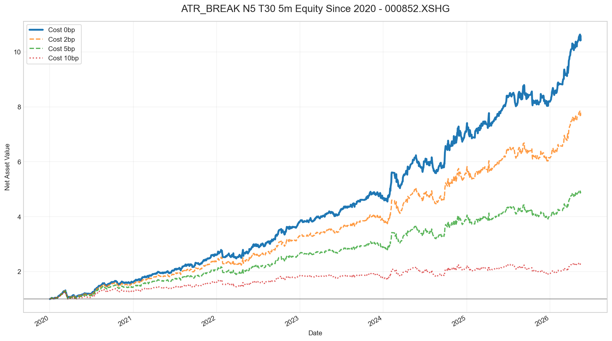

# ATR 日内突破策略研究报告：000852.XSHG

生成日期：2026-05-16

## 1. 研究结论

本次研究围绕 `000852.XSHG` 的 ATR 日内突破信号展开，主要测试 5分钟 K 线下的 ATR 通道突破与 KC-ATR 通道突破。

核心结论如下：

1. ATR 突破类信号在 2020 年至今的样本中整体有效，所有主要参数组合均取得正收益。
2. 主策略候选为 `ATR_BREAK_N5_T30`，在收益、胜率和参数稳定性上相对较优。
3. ATR 策略交易频率明显高于标准 RBreaker，几乎每天都有交易，但最大回撤也更高。
4. 多头贡献略强于空头，但空头侧也保持正收益，适合保留多空双向。
5. ATR 策略与 `RBreaker scale=0.3` 的相关性偏高，更适合作为趋势突破模块的备选或过滤器，而不是直接叠加成独立组合。

推荐后续研究基准：

```text
标的：000852.XSHG
周期：5分钟
信号：ATR_BREAK_N5_T30
交易方向：多空双向
进场：5分钟收盘触发，下一根开盘进场
出场：14:55 强制平仓
频率限制：每天最多 1 笔
```

## 2. 信号逻辑

### 2.1 ATR 通道突破

本次主策略使用 `czsc.signals.tas.tas_atr_break_V230424` 的逻辑，对应参数模板：

```text
{freq}_D{di}ATR{timeperiod}T{th}突破_BS辅助V230424
```

在本次回测中：

```text
freq = 5分钟
di = 1
timeperiod = 5
th = 30
实际倍数 k = th / 10 = 3.0
```

对每根 5分钟 K 线，计算最近 `N` 根 K 线的最高价、最低价和 ATR：

```text
HH = 最近 N 根 K 线最高价
LL = 最近 N 根 K 线最低价
ATR = N 周期平均真实波幅
k = th / 10
```

构造中性区间：

```text
上边界 = HH - k * ATR
下边界 = LL + k * ATR
```

信号判断：

```text
下边界 < close < 上边界：其他
close >= 上边界：看多
close <= 下边界：看空
```

直观理解：ATR 用于度量近期波动。当收盘价脱离由近期高低点和 ATR 构造的中性区域时，认为日内方向已经出现，顺着突破方向交易。

### 2.2 KC-ATR 通道

为了做对比，本次也测试了 KC-ATR 通道突破，逻辑为：

```text
中轨 = close 的 M 周期均线
上轨 = 中轨 + th * ATR
下轨 = 中轨 - th * ATR

close > 上轨：做多
close < 下轨：做空
```

KC-ATR 参数扫描使用：

```text
N = 30
M = 16
th = 0.8, 1.0, 1.2, 1.5, 2.0
```

KC-ATR 表现也为正，但综合结果弱于主策略候选 `ATR_BREAK_N5_T30`。

## 3. 数据与回测设定

数据源：聚宽 SDK

标的：`000852.XSHG`

回测样本：

```text
请求区间：2020-01-01 至 2026-05-16
实际5分钟数据：2020-01-02 09:35:00 至 2026-05-15 15:00:00
5分钟K线数量：73920
可交易天数：1540
```

交易设定：

| 项目 | 设定 |
|---|---|
| 信号周期 | 5分钟 |
| 信号确认 | 5分钟 K 线收盘确认 |
| 进场价格 | 下一根 5分钟 K 线开盘价 |
| 出场价格 | 14:55 对应 K 线收盘价 |
| 单日交易次数 | 最多 1 笔 |
| 基础统计 | 不计手续费滑点 |
| 成本测试 | 单笔成本 0BP、2BP、5BP、10BP |

## 4. 参数对比

长期样本中，ATR 突破与 KC-ATR 通道均有正收益。

| 策略 | 交易次数 | 胜率 | 平均收益BP | 中位收益BP | 累计收益 | 最大回撤 |
|---|---:|---:|---:|---:|---:|---:|
| ATR_BREAK_N5_T10 | 1540 | 54.48% | 11.24 | 11.52 | 399.61% | -16.40% |
| ATR_BREAK_N5_T20 | 1540 | 55.58% | 15.83 | 14.49 | 914.14% | -18.74% |
| ATR_BREAK_N5_T30 | 1528 | 56.54% | 16.03 | 13.13 | 942.30% | -20.02% |
| ATR_BREAK_N5_T40 | 875 | 58.63% | 11.53 | 12.09 | 161.67% | -19.41% |
| KCATR_N30_M16_T0.8 | 1540 | 54.55% | 11.78 | 10.08 | 442.81% | -20.37% |
| KCATR_N30_M16_T1 | 1540 | 54.29% | 12.34 | 9.31 | 493.06% | -19.21% |
| KCATR_N30_M16_T1.2 | 1540 | 54.61% | 12.23 | 9.48 | 483.60% | -19.39% |
| KCATR_N30_M16_T1.5 | 1540 | 54.87% | 13.11 | 10.08 | 569.12% | -20.92% |
| KCATR_N30_M16_T2 | 1531 | 55.13% | 14.14 | 11.11 | 678.19% | -22.87% |

从参数扫描看，`ATR_BREAK_N5_T30` 的综合表现较好：

```text
交易次数：1528
胜率：56.54%
平均收益：16.03BP
累计收益：942.30%
最大回撤：-20.02%
```

`ATR_BREAK_N5_T20` 与 `ATR_BREAK_N5_T30` 接近，但 `T30` 的胜率、平均收益和累计收益略优，因此作为当前基准参数。

## 5. 主策略表现：ATR_BREAK_N5_T30

### 5.1 多空拆分

| 分组 | 交易次数 | 覆盖率 | 胜率 | 平均收益BP | 中位收益BP | 累计收益 | 最大回撤 |
|---|---:|---:|---:|---:|---:|---:|---:|
| 全部 | 1528 | 99.22% | 56.54% | 16.03 | 13.13 | 942.30% | -20.02% |
| 多头 | 832 | 54.03% | 58.65% | 17.02 | 16.55 | 292.62% | -11.36% |
| 空头 | 696 | 45.19% | 54.02% | 14.84 | 9.33 | 165.47% | -11.82% |

多头侧胜率和平均收益略高，但空头侧同样贡献正收益。考虑到 `000852.XSHG` 指数具有明显波动和趋势切换特征，当前不建议只保留多头。

### 5.2 成本敏感性

| 单笔成本 | 交易次数 | 胜率 | 平均收益BP | 中位收益BP | 期末净值 | 累计收益 | 最大回撤 |
|---:|---:|---:|---:|---:|---:|---:|---:|
| 0BP | 1528 | 56.54% | 16.03 | 13.13 | 10.4230 | 942.30% | -20.02% |
| 2BP | 1528 | 55.76% | 14.03 | 11.13 | 7.6816 | 668.16% | -20.15% |
| 5BP | 1528 | 54.45% | 11.03 | 8.13 | 4.8595 | 385.95% | -20.35% |
| 10BP | 1528 | 51.90% | 6.03 | 3.13 | 2.2648 | 126.48% | -21.54% |

ATR 策略在 5BP 成本下仍保持正收益，但收益被明显压缩。由于交易频率接近每天一笔，实际使用时需要重点控制冲击成本、滑点和成交质量。

### 5.3 分年表现

| 年份 | 交易次数 | 胜率 | 平均收益BP | 累计收益 | 最大回撤 |
|---:|---:|---:|---:|---:|---:|
| 2020 | 243 | 56.38% | 20.83 | 62.55% | -20.02% |
| 2021 | 241 | 59.34% | 20.24 | 61.12% | -4.45% |
| 2022 | 239 | 60.25% | 16.32 | 44.63% | -11.25% |
| 2023 | 240 | 54.58% | 9.27 | 24.04% | -5.23% |
| 2024 | 242 | 53.31% | 19.06 | 54.44% | -10.46% |
| 2025 | 240 | 52.50% | 5.63 | 12.81% | -8.68% |
| 2026 | 83 | 65.06% | 29.64 | 27.33% | -2.96% |

分年结果显示，`ATR_BREAK_N5_T30` 在所有年度均为正收益，但年度收益差异较大。2023、2025 年收益明显降低，说明策略对趋势波动环境有依赖。

主策略净值图：



## 6. 与 RBreaker 的关系

前面对 `RBreaker scale=0.3` 与 `ATR_BREAK_N5_T30` 做了相关性评估：

| 口径 | Pearson | Spearman | 同涨同跌占比 |
|---|---:|---:|---:|
| 全日历日，空仓收益为 0 | 0.6073 | 0.5998 | 40.97% |
| 双方都有交易的日期 | 0.6200 | 0.6930 | 79.68% |
| 月度收益 | 0.5430 | 0.4869 | 84.42% |

共同交易日方向一致占比为 `82.19%`。这说明两者虽然公式不同，但都在捕捉 5分钟级别的日内趋势突破，收益来源具有较高重合度。

与 RBreaker `scale=0.3` 的长期表现对比：

| 策略 | 交易次数 | 胜率 | 平均收益BP | 累计收益 | 最大回撤 |
|---|---:|---:|---:|---:|---:|
| RBreaker scale=0.3 | 1203 | 60.43% | 20.44 | 995.87% | -10.73% |
| ATR_BREAK_N5_T30 | 1528 | 56.54% | 16.03 | 942.30% | -20.02% |

结论：ATR 信号数量更多，但单笔质量和回撤控制弱于 RBreaker。当前更适合把 ATR 作为辅助模块，而不是直接替代 RBreaker 主策略。

## 7. 风险与不足

1. 交易频率过高：`ATR_BREAK_N5_T30` 覆盖率为 `99.22%`，几乎每天交易，实盘成本和滑点压力更大。
2. 回撤偏高：长期最大回撤达到 `-20.02%`，显著高于 RBreaker `scale=0.3`。
3. 与 RBreaker 相关性偏高：简单叠加不能显著提升组合分散度。
4. 参数存在环境依赖：2023、2025 年收益明显偏弱，说明震荡或低波动环境下边际下降。
5. 当前回测仍是事件式简化回测，没有考虑盘口冲击、实际可成交量、手续费结构和指数产品约束。

## 8. 后续建议

### 8.1 不建议直接独立上线

单看历史收益，ATR 策略表现不错；但考虑到交易频率、回撤和与 RBreaker 的相关性，不建议将其作为独立主策略直接上线。

更合理的定位是：

```text
RBreaker scale=0.3：主策略
ATR_BREAK_N5_T30：辅助确认、过滤、风控或备用信号
```

### 8.2 研究 ATR 过滤器

可以测试以下组合逻辑：

```text
仅当 RBreaker 与 ATR 方向一致时进场
仅当 ATR 不反向时允许 RBreaker 进场
RBreaker 触发后，ATR 反向作为提前止盈或止损条件
```

重点观察是否能降低 RBreaker 的最大回撤，而不是单纯追求提高收益。

### 8.3 降低交易频率

当前 ATR 几乎每天交易，后续可以增加过滤条件：

```text
只在 ATR 突破强度超过阈值时交易
只在开盘后特定时间段内接受信号
避开午后低波动时段的首次信号
增加日线或30分钟趋势过滤
限制连续同向或连续亏损后的交易
```

目标是减少低质量交易，把交易次数从每年约 240 笔降到更可控的水平。

### 8.4 做参数稳健性验证

目前 `N=5, T=30` 表现最好，但仍需要进一步验证：

```text
N: 3, 5, 8, 10, 13
T: 15, 20, 25, 30, 35, 40
出场时间：14:45, 14:50, 14:55, 15:00
成本：2BP, 5BP, 10BP
```

建议用滚动训练测试或 walk-forward 方法，避免单一长期样本下的参数偶然性。

### 8.5 扩展到其他中证指数

为了确认策略不是 `000852.XSHG` 的样本特例，建议扩展到：

```text
000300.XSHG
000905.XSHG
000852.XSHG
932000.CSI
```

如果在多个宽基指数上都能保持正收益，ATR 信号才更适合进入正式策略库。

## 9. 文件索引

研究脚本：

```text
examples/signals_dev/backtest_atr_000852_5m.py
```

结果文件：

```text
examples/results/atr_000852_jq_sdk/atr_5m_2020_trades.csv
examples/results/atr_000852_jq_sdk/atr_5m_2020_summary.csv
examples/results/atr_000852_jq_sdk/atr_5m_2020_cost.csv
examples/results/atr_000852_jq_sdk/atr_5m_2020_yearly.csv
examples/results/atr_000852_jq_sdk/atr_break_n5_t30_5m_2020_equity.png
```
