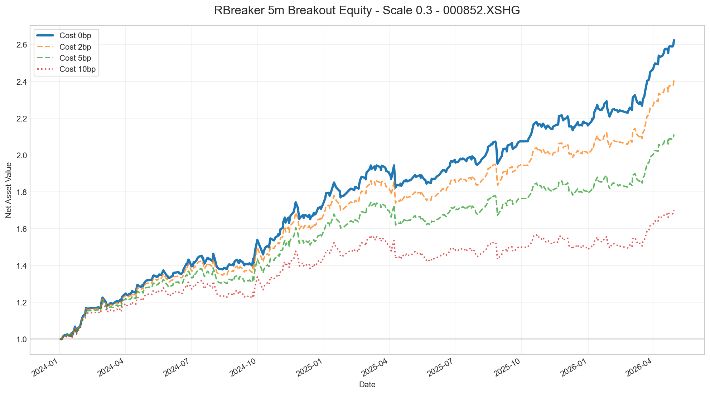
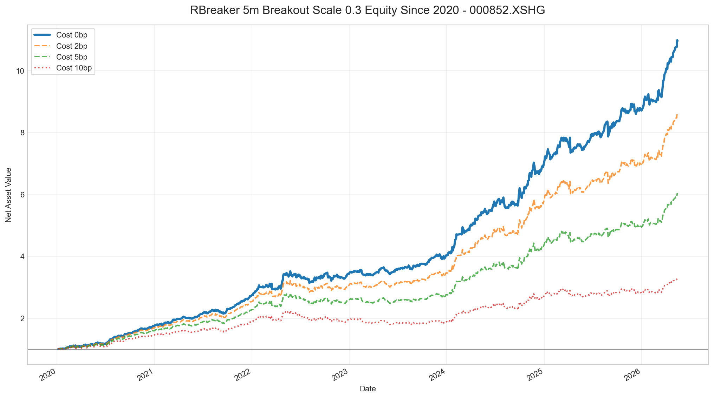

# RBreaker 日内突破策略研究报告：000852.XSHG

生成日期：2026-05-16

## 1. 研究结论

本次研究围绕 `000852.XSHG` 的 RBreaker 日内交易信号展开。核心结论如下：

1. 标准 RBreaker 的趋势突破信号有效性优于反转信号。
2. 5分钟 K 线优于 1分钟 K 线；1分钟信号更早但单笔边际变薄，成本敏感性更高。
3. 标准 RBreaker 信号偏少，使用 `scale` 将突破价位向当日开盘价收缩后，信号数量和收益表现明显改善。
4. 在当前样本中，`scale=0.3` 是较优参数：信号数量充足、分年表现稳定、成本后仍有较强收益。
5. 需要注意，`scale=0.3` 已经不是标准 RBreaker，更接近“开盘后轻微突破方向跟随”策略。

推荐后续研究基准：

```text
标的：000852.XSHG
周期：5分钟
信号：RBreaker 趋势突破
参数：scale = 0.3
交易方向：多空双向
进场：5分钟收盘触发，下一根开盘进场
出场：14:55 强制平仓
频率限制：每天最多 1 笔
```

## 2. 策略逻辑

RBreaker 使用前一交易日的高、低、收计算当日 6 个关键价位。

设前一交易日：

```text
H = 前一日最高价
L = 前一日最低价
C = 前一日收盘价
P = (H + L + C) / 3
```

标准 RBreaker 价位：

```text
突破买入价 = H + 2P - 2L
观察卖出价 = P + H - L
反转卖出价 = 2P - L

反转买入价 = 2P - H
观察买入价 = P - (H - L)
突破卖出价 = L - 2(H - P)
```

本研究主要使用趋势突破模式：

```text
5分钟收盘价 > 突破买入价：做多
5分钟收盘价 < 突破卖出价：做空
```

反转模式也做了测试：

```text
当日最高价 > 观察卖出价，随后收盘价 < 反转卖出价：做空反转
当日最低价 < 观察买入价，随后收盘价 > 反转买入价：做多反转
```

## 3. 参数 scale 的含义

标准 RBreaker 信号偏少，因此引入价位缩放参数 `scale`。缩放后的价位计算方式为：

```text
调整后价位 = 当日开盘价 + scale * (标准价位 - 当日开盘价)
```

含义：

| scale | 含义 |
|---:|---|
| < 1.0 | 突破线向开盘价收缩，信号增加 |
| = 1.0 | 标准 RBreaker |
| > 1.0 | 突破线远离开盘价，信号减少 |

本次研究发现，`scale=0.3` 在信号数量、收益和回撤之间表现较好。

## 4. 数据与回测设定

数据源：聚宽 SDK

标的：`000852.XSHG`

主要长期样本：

```text
请求区间：2020-01-01 至 2026-05-16
实际日线数据：2020-01-02 至 2026-05-15
实际5分钟数据：2020-01-02 09:35:00 至 2026-05-15 15:00:00
日线数量：1540
5分钟K线数量：73920
可交易天数：1539
```

交易设定：

| 项目 | 设定 |
|---|---|
| 信号周期 | 5分钟 |
| 信号确认 | 5分钟 K 线收盘确认 |
| 进场价格 | 下一根 5分钟 K 线开盘价 |
| 出场价格 | 14:55 对应 K 线收盘价 |
| 单日交易次数 | 最多 1 笔 |
| 基础统计 | 不计手续费滑点 |
| 成本测试 | 单笔成本 0BP、2BP、5BP、10BP |

## 5. 标准 RBreaker 结果

标准参数 `scale=1.0` 下，5分钟趋势突破信号偏少，但仍有正收益。

| 策略 | 交易次数 | 胜率 | 平均收益BP | 累计收益 | 最大回撤 |
|---|---:|---:|---:|---:|---:|
| 趋势突破_双向 | 78 | 60.26% | 10.99 | 8.19% | -6.44% |
| 趋势突破_只做多 | 34 | 73.53% | 13.51 | 4.47% | -5.01% |
| 趋势突破_只做空 | 44 | 50.00% | 9.05 | 3.56% | -8.90% |

反转信号表现较弱：

| 策略 | 交易次数 | 胜率 | 平均收益BP | 累计收益 | 最大回撤 |
|---|---:|---:|---:|---:|---:|
| 趋势加反转_双向 | 129 | 55.04% | 3.03 | 2.92% | -9.53% |
| 只反转_双向 | 69 | 49.28% | -6.21 | -4.53% | -10.18% |
| 只反转_只做多 | 46 | 52.17% | -1.64 | -1.01% | -7.94% |
| 只反转_只做空 | 23 | 43.48% | -15.36 | -3.55% | -4.15% |

结论：反转信号会增加交易次数，但显著拉低策略质量，当前不建议纳入主策略。

## 6. 1分钟与5分钟对比

标准参数 `scale=1.0` 下，1分钟版本触发略多，但单笔收益更薄。

| 周期 | 策略 | 交易次数 | 胜率 | 平均收益BP | 累计收益 | 最大回撤 |
|---|---|---:|---:|---:|---:|---:|
| 5分钟 | 趋势突破_双向 | 78 | 60.26% | 10.99 | 8.19% | -6.44% |
| 1分钟 | 趋势突破_双向 | 88 | 54.55% | 4.96 | 3.59% | -8.35% |

1分钟趋势突破在 5BP 单笔成本后已经接近失效：

| 单笔成本 | 交易次数 | 平均收益BP | 累计收益 | 最大回撤 |
|---:|---:|---:|---:|---:|
| 0BP | 88 | 4.96 | 3.59% | -8.35% |
| 2BP | 88 | 2.96 | 1.78% | -8.59% |
| 5BP | 88 | -0.04 | -0.87% | -8.95% |
| 10BP | 88 | -5.04 | -5.14% | -10.20% |

结论：继续使用 5分钟 K 线更合理。

## 7. scale 参数敏感性

在 2024-01-01 至 2026-04-30 样本上，对 5分钟趋势突破做了 `scale` 参数扫描。

| scale | 交易次数 | 胜率 | 平均收益BP | 累计收益 | 最大回撤 |
|---:|---:|---:|---:|---:|---:|
| 0.2 | 528 | 56.82% | 18.91 | 161.04% | -10.88% |
| 0.3 | 435 | 59.77% | 22.80 | 162.38% | -6.19% |
| 0.4 | 360 | 58.33% | 18.25 | 88.79% | -6.42% |
| 0.5 | 282 | 55.67% | 12.64 | 40.25% | -7.04% |
| 0.6 | 215 | 56.74% | 11.81 | 26.97% | -8.22% |
| 0.8 | 126 | 58.73% | 16.89 | 22.66% | -3.79% |
| 1.0 | 78 | 60.26% | 10.99 | 8.19% | -6.44% |

`scale=0.3` 在信号数量和收益质量上表现突出。相比标准 RBreaker：

```text
交易次数：78 -> 435
平均收益BP：10.99 -> 22.80
累计收益：8.19% -> 162.38%
最大回撤：-6.44% -> -6.19%
```

`scale=0.3` 净值图：



## 8. 2020年至今长期回测

使用 `scale=0.3`，在 2020-01-01 至 2026-05-16 区间做长期回测，实际数据截止 2026-05-15。

整体结果：

| 分组 | 交易次数 | 胜率 | 平均收益BP | 中位收益BP | 累计收益 | 最大回撤 |
|---|---:|---:|---:|---:|---:|---:|
| 全部 | 1203 | 60.43% | 20.44 | 18.03 | 995.87% | -10.73% |
| 多头 | 613 | 63.13% | 24.14 | 20.48 | 329.30% | -7.01% |
| 空头 | 590 | 57.63% | 16.58 | 14.82 | 155.27% | -10.03% |

成本敏感性：

| 单笔成本 | 交易次数 | 胜率 | 平均收益BP | 期末净值 | 累计收益 | 最大回撤 |
|---:|---:|---:|---:|---:|---:|---:|
| 0BP | 1203 | 60.43% | 20.44 | 10.9587 | 995.87% | -10.73% |
| 2BP | 1203 | 58.52% | 18.44 | 8.6191 | 761.91% | -11.53% |
| 5BP | 1203 | 56.53% | 15.44 | 6.0114 | 501.14% | -12.72% |
| 10BP | 1203 | 54.61% | 10.44 | 3.2965 | 229.65% | -20.28% |

长期净值图：



分年结果：

| 年份 | 交易次数 | 胜率 | 平均收益BP | 累计收益 | 最大回撤 |
|---:|---:|---:|---:|---:|---:|
| 2020 | 182 | 64.84% | 31.82 | 76.28% | -4.93% |
| 2021 | 192 | 65.10% | 23.35 | 55.66% | -5.63% |
| 2022 | 198 | 57.07% | 11.89 | 24.75% | -10.73% |
| 2023 | 188 | 55.85% | 8.94 | 17.72% | -6.13% |
| 2024 | 189 | 61.90% | 30.27 | 74.51% | -5.82% |
| 2025 | 185 | 55.68% | 12.03 | 23.81% | -6.19% |
| 2026 | 69 | 66.67% | 33.75 | 25.87% | -3.63% |

结论：长期样本中各年度均为正收益，没有明显依赖单一年份。

## 9. 主要风险

### 9.1 标的不可直接交易

`000852.XSHG` 是中证1000指数，本身不能直接交易。若用于实盘，需要映射到：

- 中证1000股指期货 IM；
- 中证1000 ETF；
- 其他高相关可交易工具。

指数信号与真实可交易品种之间会存在基差、跟踪误差、流动性和交易成本差异。

### 9.2 参数优化风险

`scale=0.3` 是通过样本内扫描得到的，存在过拟合风险。虽然 2020 年以来分年表现较稳定，但仍需要：

- 滚动样本外验证；
- 在其他指数上验证；
- 在实际交易品种上验证；
- 检查不同市场环境下的表现衰减。

### 9.3 成本与滑点

本研究基础收益以指数价格计算。即使做了 2BP、5BP、10BP 成本敏感性，真实交易还需要考虑：

- 开平仓滑点；
- 盘口冲击；
- 期货保证金和换月；
- ETF 申赎、折溢价和流动性；
- 做空约束。

### 9.4 信号定义已偏离标准 RBreaker

`scale=0.3` 将标准突破线大幅向开盘价收缩，信号性质已经发生变化。它保留了 RBreaker 的前日 HLC 框架，但交易含义更接近“日内方向跟随”。

## 10. 后续建议

建议按以下优先级继续推进：

1. 使用 `scale=0.3` 作为主基准，映射到 IM 主力连续合约验证。
2. 做滚动样本外测试，例如 2020-2022 选参、2023-2026 验证。
3. 增加真实交易成本模型：手续费、滑点、期货换月、保证金收益率。
4. 验证其他标的：沪深300、中证500、中证1000、创业板指。
5. 尝试风控增强：波动率过滤、开盘前 15 分钟禁入、午后禁入、止损和移动止盈。
6. 检查极端行情日的贡献，判断收益是否来自少数异常日。

## 11. 研究产物

主要脚本：

- [5分钟 RBreaker 研究脚本](../../signals_dev/backtest_rbreaker_000852_5m.py)
- [1分钟 RBreaker 研究脚本](../../signals_dev/backtest_rbreaker_000852_1m.py)
- [2020年至今 scale=0.3 长期回测脚本](../../signals_dev/backtest_rbreaker_000852_5m_s03_2020.py)

主要结果文件：

- [2020年至今交易明细](rbreaker_5m_s03_2020_trades.csv)
- [2020年至今汇总结果](rbreaker_5m_s03_2020_summary.csv)
- [2020年至今年度拆分](rbreaker_5m_s03_2020_yearly.csv)
- [2020年至今成本敏感性](rbreaker_5m_s03_2020_cost.csv)
- [scale 激进参数扫描](rbreaker_5m_breakout_scale_aggressive_sweep.csv)
- [scale=0.3 交易明细](rbreaker_5m_breakout_scale_aggressive_trades.csv)
