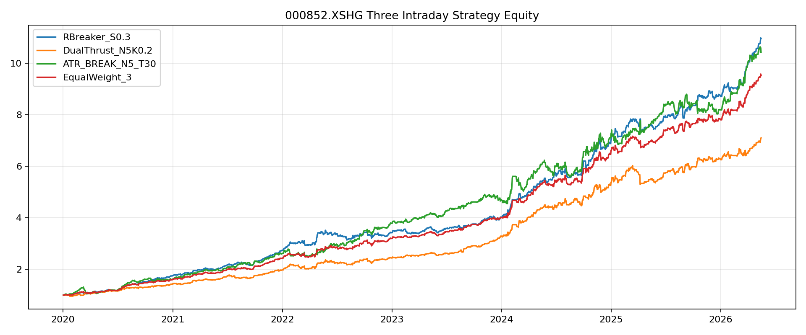
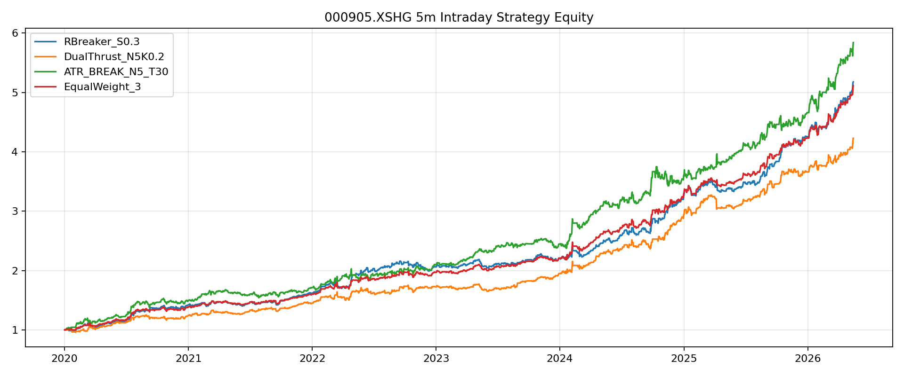
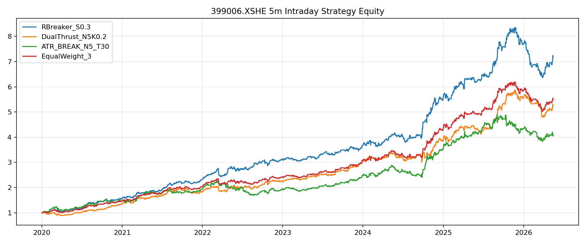

# 三策略日内突破汇总研究报告

生成日期：2026-05-17

## 1. 研究结论

本次研究对三个日内突破策略进行了统一口径回测与相关性评估：

1. `RBreaker_S0.3`
2. `DualThrust_N5K0.2`
3. `ATR_BREAK_N5_T30`

测试标的包括：

```text
000852.XSHG  中证1000指数
000905.XSHG  中证500指数
399006.XSHE  创业板指
```

核心结论：

1. 三个策略均属于日内趋势突破类，收益来源高度重合，不能简单视为三套独立 alpha。
2. `RBreaker_S0.3` 综合表现最好，适合作为主策略框架。
3. `DualThrust_N5K0.2` 与 RBreaker 相关性最高，更适合作为 RBreaker 的简化对照组或确认信号，不适合作为独立仓位直接叠加。
4. `ATR_BREAK_N5_T30` 交易频率最高，在 `000905.XSHG` 上表现较好，但在 `000852.XSHG` 和 `399006.XSHE` 上回撤明显偏高，更适合做过滤、止损或波动环境判断。
5. 三策略等权组合能降低回撤，但收益提升并不稳定；组合价值主要来自平滑，而不是来自低相关分散。

推荐实盘优先级：

```text
主策略：RBreaker_S0.3
确认信号：DualThrust_N5K0.2
风控 / 过滤：ATR_BREAK_N5_T30
组合方式：投票、过滤、降仓，而不是三套策略满仓并行
```

## 2. 策略逻辑

### 2.1 RBreaker_S0.3

RBreaker 使用前一交易日的高、低、收计算当日关键价位。

设前一交易日：

```text
H = 前一日最高价
L = 前一日最低价
C = 前一日收盘价
P = (H + L + C) / 3
```

本研究只使用趋势突破价位：

```text
标准突破买入价 = H + 2P - 2L
标准突破卖出价 = L - 2(H - P)
```

为了增加信号数量，使用 `scale=0.3` 将价位向当日开盘价收缩：

```text
调整后价位 = 当日开盘价 + 0.3 * (标准价位 - 当日开盘价)
```

交易规则：

```text
5分钟收盘价 > 调整后突破买入价：做多
5分钟收盘价 < 调整后突破卖出价：做空
```

这个版本已经不是标准 RBreaker，更接近“开盘后轻微突破方向跟随”策略。

### 2.2 DualThrust_N5K0.2

Dual Thrust 使用过去 `N` 个交易日的价格区间，结合当日开盘价生成固定上下轨。

本研究参数：

```text
N = 5
K1 = 0.2
K2 = 0.2
```

过去 N 日：

```text
HH = N日最高价最大值
HC = N日收盘价最大值
LC = N日收盘价最小值
LL = N日最低价最小值
Range = max(HH - LC, HC - LL)
```

当日通道：

```text
上轨 = 当日开盘价 + Range * K1
下轨 = 当日开盘价 - Range * K2
```

交易规则：

```text
5分钟收盘价 > 上轨：做多
5分钟收盘价 < 下轨：做空
```

Dual Thrust 和 RBreaker 都是“历史区间 + 当日开盘价”的日内突破模型，因此两者天然高度相关。

### 2.3 ATR_BREAK_N5_T30

ATR 策略使用近期 5分钟 K 线的波动区间和 ATR 构造动态突破信号。

本研究参数：

```text
N = 5
T = 30
ATR倍数 = T / 10 = 3.0
```

对最近 N 根 5分钟 K 线：

```text
HH = 最近 N 根 K 线最高价
LL = 最近 N 根 K 线最低价
ATR = N周期平均真实波幅
```

构造中性区：

```text
上边界 = HH - 3 * ATR
下边界 = LL + 3 * ATR
```

交易规则：

```text
收盘价脱离中性区上方：做多
收盘价脱离中性区下方：做空
```

ATR 信号更敏感，交易覆盖率通常接近每天一笔，因此对滑点和交易成本更敏感。

## 3. 回测设定

数据源：聚宽 SDK

样本区间：

```text
请求区间：2020-01-01 至 2026-05-17
实际数据截止：2026-05-15
周期：5分钟
```

交易设定：

| 项目 | 设定 |
|---|---|
| 信号确认 | 5分钟 K 线收盘确认 |
| 进场价格 | 下一根 5分钟 K 线开盘价 |
| 出场价格 | 14:55 对应 K 线收盘价 |
| 单日交易次数 | 每个策略每天最多 1 笔 |
| 交易方向 | 多空双向 |
| 基础统计 | 不计手续费滑点 |

注意：本报告是研究回测，不包含盘口冲击、实际可成交量、手续费结构、指数产品约束等实盘因素。

## 4. 单策略回测表现

### 4.1 000852.XSHG

| 策略 | 交易次数 | 胜率 | 平均收益BP | 中位收益BP | 累计收益 | 最大回撤 |
|---|---:|---:|---:|---:|---:|---:|
| RBreaker_S0.3 | 1203 | 60.43% | 20.44 | 18.03 | 995.87% | -10.73% |
| DualThrust_N5K0.2 | 1141 | 61.00% | 17.72 | 18.42 | 609.84% | -12.06% |
| ATR_BREAK_N5_T30 | 1528 | 56.54% | 16.03 | 13.13 | 942.30% | -20.02% |

结论：`RBreaker_S0.3` 是最优主策略。`ATR_BREAK_N5_T30` 收益接近，但最大回撤显著更高。`DualThrust_N5K0.2` 胜率不错，但收益弱于 RBreaker。

### 4.2 000905.XSHG

| 策略 | 交易次数 | 胜率 | 平均收益BP | 中位收益BP | 累计收益 | 最大回撤 |
|---|---:|---:|---:|---:|---:|---:|
| RBreaker_S0.3 | 1190 | 57.65% | 14.25 | 11.91 | 417.70% | -8.25% |
| DualThrust_N5K0.2 | 1166 | 59.01% | 12.81 | 11.11 | 322.75% | -8.46% |
| ATR_BREAK_N5_T30 | 1511 | 55.46% | 12.18 | 10.45 | 483.95% | -9.19% |

结论：`000905.XSHG` 上 ATR 收益最高，但 RBreaker 的回撤更低。三策略差距没有 `000852.XSHG` 上那么明显。

### 4.3 399006.XSHE

| 策略 | 交易次数 | 胜率 | 平均收益BP | 中位收益BP | 累计收益 | 最大回撤 |
|---|---:|---:|---:|---:|---:|---:|
| RBreaker_S0.3 | 1221 | 56.27% | 16.86 | 13.80 | 617.39% | -23.65% |
| DualThrust_N5K0.2 | 1182 | 56.51% | 14.79 | 13.68 | 425.24% | -18.30% |
| ATR_BREAK_N5_T30 | 1503 | 53.09% | 10.18 | 7.95 | 306.21% | -25.93% |

结论：`399006.XSHE` 上 RBreaker 收益最高，但回撤也较大；Dual Thrust 收益较低但回撤好于 RBreaker；ATR 表现最弱，不适合单独作为主策略。

## 5. 相关性与方向重合

### 5.1 000852.XSHG

| 策略对 | 全日历日 Pearson | 共同交易日 Pearson | 月度收益 Pearson | 方向一致占比 |
|---|---:|---:|---:|---:|
| RBreaker / DualThrust | 0.7094 | 0.7305 | 0.7000 | 93.57% |
| RBreaker / ATR | 0.6073 | 0.6200 | 0.5435 | 82.19% |
| DualThrust / ATR | 0.4599 | 0.4734 | 0.2021 | 80.37% |

### 5.2 000905.XSHG

| 策略对 | 全日历日 Pearson | 共同交易日 Pearson | 月度收益 Pearson | 方向一致占比 |
|---|---:|---:|---:|---:|
| RBreaker / DualThrust | 0.7480 | 0.7769 | 0.6746 | 93.79% |
| RBreaker / ATR | 0.6641 | 0.6826 | 0.5522 | 82.26% |
| DualThrust / ATR | 0.5061 | 0.5276 | 0.3097 | 78.09% |

### 5.3 399006.XSHE

| 策略对 | 全日历日 Pearson | 共同交易日 Pearson | 月度收益 Pearson | 方向一致占比 |
|---|---:|---:|---:|---:|
| RBreaker / DualThrust | 0.7540 | 0.7929 | 0.6942 | 93.59% |
| RBreaker / ATR | 0.6275 | 0.6436 | 0.5770 | 82.53% |
| DualThrust / ATR | 0.4989 | 0.5172 | 0.3543 | 77.98% |

相关性结论：

1. RBreaker 与 Dual Thrust 的相关性最高，方向一致占比稳定在 93% 以上。
2. ATR 与另外两个策略相关性略低，但方向一致占比仍接近或超过 78%。
3. 三个策略不是相互独立的收益来源，本质都是日内趋势突破。

## 6. 组合表现

### 6.1 000852.XSHG

| 组合 / 策略 | 累计收益 | 最大回撤 | 收益回撤比 |
|---|---:|---:|---:|
| RBreaker_S0.3 | 995.87% | -10.73% | 92.82 |
| DualThrust_N5K0.2 | 609.84% | -12.06% | 50.57 |
| ATR_BREAK_N5_T30 | 942.30% | -20.02% | 47.07 |
| 三策略等权 | 853.22% | -7.05% | 121.04 |

三策略等权显著降低回撤，但收益低于 RBreaker 单策略。

### 6.2 000905.XSHG

| 组合 / 策略 | 累计收益 | 最大回撤 | 收益回撤比 |
|---|---:|---:|---:|
| RBreaker_S0.3 | 417.70% | -8.25% | 50.62 |
| DualThrust_N5K0.2 | 322.75% | -8.46% | 38.14 |
| ATR_BREAK_N5_T30 | 483.95% | -9.19% | 52.67 |
| 三策略等权 | 411.30% | -6.11% | 67.32 |

三策略等权的收益回撤比最好，但收益略低于 ATR 单策略。

### 6.3 399006.XSHE

| 组合 / 策略 | 累计收益 | 最大回撤 | 收益回撤比 |
|---|---:|---:|---:|
| RBreaker_S0.3 | 617.39% | -23.65% | 26.11 |
| DualThrust_N5K0.2 | 425.24% | -18.30% | 23.23 |
| ATR_BREAK_N5_T30 | 306.21% | -25.93% | 11.81 |
| 三策略等权 | 449.31% | -18.89% | 23.78 |

`399006.XSHE` 上三策略等权降低了回撤，但明显牺牲收益。该标的更适合以 RBreaker 为主，并单独加强风控。

## 7. 实盘建议

### 7.1 策略角色分工

建议不要把三套策略作为三个独立满仓信号并行交易，而是分工使用：

| 策略 | 建议角色 | 理由 |
|---|---|---|
| RBreaker_S0.3 | 主策略 | 综合收益、单笔质量和跨标的稳定性最好 |
| DualThrust_N5K0.2 | 确认信号 / 替代通道 | 与 RBreaker 高度同源，不适合独立叠加 |
| ATR_BREAK_N5_T30 | 风控过滤 / 波动环境判断 | 交易频率高，回撤偏大，但能反映短期波动方向 |

### 7.2 推荐实盘组合逻辑

优先测试以下组合，而不是三策略简单等权：

```text
主信号：RBreaker_S0.3
确认条件：DualThrust 同方向时满仓，否则半仓或跳过
风控条件：ATR 反向时减仓或不进场
出场规则：14:55 强平；同时测试 ATR 反向提前平仓
```

一个更保守的版本：

```text
RBreaker 触发做多，且 ATR 不看空，允许进场
RBreaker 触发做空，且 ATR 不看多，允许进场
DualThrust 同方向时提高仓位
DualThrust 反方向时降低仓位
```

### 7.3 分标的建议

| 标的 | 建议 |
|---|---|
| 000852.XSHG | RBreaker 为主；三策略等权可作为低回撤版本备选 |
| 000905.XSHG | 可重点研究 RBreaker + ATR；ATR 在该标的上表现相对更好 |
| 399006.XSHE | RBreaker 为主，ATR 不建议独立交易；重点控制回撤 |

### 7.4 仓位建议

初始实盘不建议满仓运行。建议从策略级别风控开始：

```text
单标的单策略基础仓位：0.3 ~ 0.5
RBreaker 与 DualThrust 同向：提高到目标仓位
ATR 反向：降低到 0 或 0.5 倍目标仓位
连续亏损 2~3 笔：暂停该标的 1~3 个交易日
单标的日内亏损达到阈值：当日停止新开仓
```

### 7.5 成本与滑点

当前统计不计手续费滑点。由于 ATR 交易频率最高，对成本最敏感。实盘前必须做以下压力测试：

```text
单笔成本：2BP、5BP、10BP
进场滑点：下一根开盘价 ± 1~2 tick
延迟进场：信号后一根 / 两根 K 线
成交限制：开盘后前10分钟和尾盘最后10分钟是否允许交易
```

### 7.6 后续研究方向

建议下一步优先做四类验证：

1. 参数稳健性：RBreaker `scale`、Dual Thrust `N/K`、ATR `N/T` 的滚动样本稳定性。
2. 组合规则：比较“等权并行”和“主信号 + 过滤器”的差异。
3. 成本压力：至少覆盖 2BP、5BP、10BP。
4. 产品映射：从指数回测迁移到 ETF、股指期货或可交易代理品种时，需要重新评估可成交性与交易成本。

## 8. 净值图

### 000852.XSHG



### 000905.XSHG



### 399006.XSHE



## 9. 文件索引

主要研究脚本：

```text
examples/signals_dev/backtest_rbreaker_000852_5m_s03_2020.py
examples/signals_dev/backtest_dual_thrust_000852_5m.py
examples/signals_dev/backtest_atr_000852_5m.py
examples/signals_dev/backtest_three_strategies_multi_index_5m.py
```

主要结果文件：

```text
examples/results/three_strategy_000852/three_strategy_performance.csv
examples/results/three_strategy_000852/three_strategy_pairwise_correlation.csv
examples/results/three_strategy_000852/three_strategy_combo_performance.csv

examples/results/three_strategy_multi_index_jq_sdk/multi_index_strategy_summary.csv
examples/results/three_strategy_multi_index_jq_sdk/multi_index_pairwise_correlation.csv
examples/results/three_strategy_multi_index_jq_sdk/multi_index_combo_summary.csv
```
